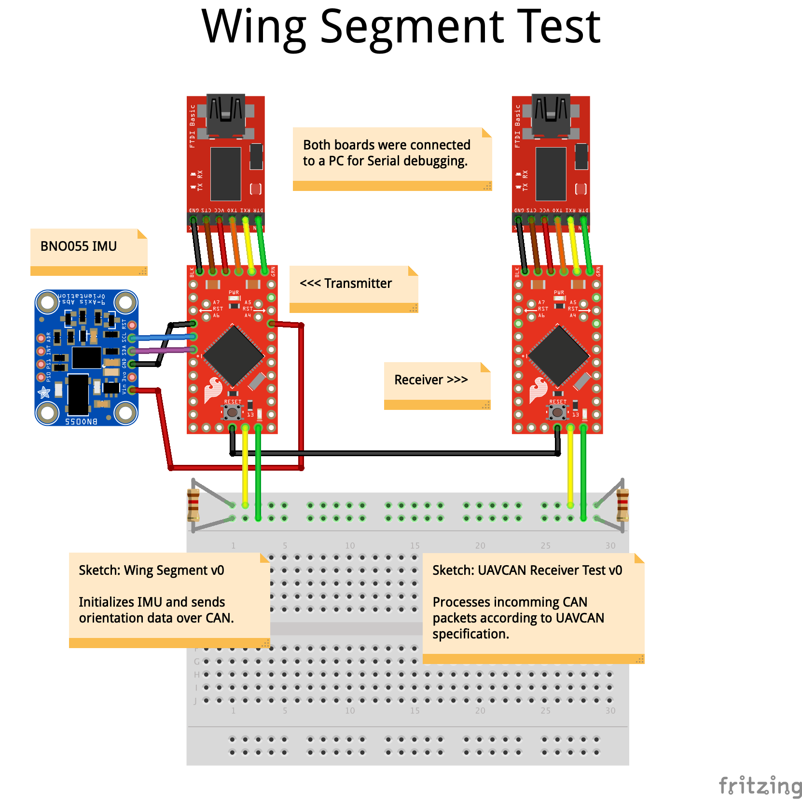

# Wing Segmet (UAVCAN v0)

Implements a UAVCAN node on the AST-CAN485 for the purpose of sending BNO055 data of wing segment orientation onto a CAN bus to a PX4 based flight controller.

Uses a sequential task structure with separate execution periods for each task.

    Task 0 - Setup
    Task 1 - Update IMU
    Task 2 - Send Node Status
    Task 3 - Send Orientation
    Task 4 - Check Memory Pool

## Task 0 - Setup

Initializes all modules according to configuration values set in the source file. 

Called once upon powering the module.

## Task 1 - Update IMU

Updates the IMU processing filters for the LSM9DS1 and NXP_FXOS_FXAS, ignored by the BNO055. 

Must be done at a freqency of `FILTER_UPDATE_RATE_HZ` defined internally by the IMU used.

## Task 2 - Send Node Status

Sends a UAVCAN Node Status message onto the CAN bus. Required by each UAVCAN node at least once every second.

### Node Status

```
#
# Abstract node status information.
#

uint32 uptime_sec
uint2 health
uint3 mode
uint3 sub_mode
uint16 vendor_specific_status_code
```

## Task 3 - Send Orientation

Sends BNO055 orientation data onto the CAN bus encoded in an UAVCAN Angular Command message.

### Angular Command

```
#
# Generic camera gimbal control.
#

uint8 gimbal_id
Mode mode
float16[4] quaternion_xyzw
```

## Task 4 - Check Memory Pool

Checks the memory usage statistics of the Canard memory pool. 

Used for debugging and development purposes.

### Canard Pool Allocator Statistics
```
typedef struct
{
    uint16_t capacity_blocks;               ///< Pool capacity in number of blocks
    uint16_t current_usage_blocks;          ///< Number of blocks that are currently allocated by the library
    uint16_t peak_usage_blocks;             ///< Maximum number of blocks used since initialization
} CanardPoolAllocatorStatistics;
```

## Test Setup


