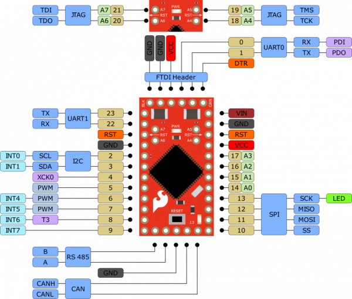

# AST-CAN485

Code for the AST-CAN485 development board to obtain IMU sensor orientation data and broadcast it to a PX4 based flight controller.

## Contrubtors

Joe DeFrance (defra022@umn.edu)

## Getting Started

This project was created using the [Arduino IDE](https://www.arduino.cc/en/main/software) for the [AST-CAN485](https://www.sparkfun.com/products/14483) board.

### AST-CAN485 Pinout



Image courtesy of Sparkfun's [AST-CAN485 Hookup Guide](https://learn.sparkfun.com/tutorials/ast-can485-hookup-guide?_ga=2.39481377.365903456.1581038177-271346267.1574810854)

### Installing

1. Download the Arduino IDE.

2. Copy this project's `Arduino` folder contents to the created `Arduino` folder 

   * Default location is in the user's `Documents` folder.

   * If the Arduino IDE is already downloaded, copy over all but the `Arduino/libraries` folder, whose contents should instead be copied to the corresponding `Arduino/libraries` folder as to not delete other libraries that may be already downloaded.

3. Use the Arduino IDE Boards Manager to add the AST-CAN485 board to the Arduino IDE.

   * Follow the steps in the [AST-CAN485 Hookup Guide](https://learn.sparkfun.com/tutorials/ast-can485-hookup-guide?_ga=2.6567157.631132834.1583434944-271346267.1574810854) section `"Board Installation Using the Boards Manager"`.

### Compiling

1. Open the `wing_segment_v0.ino` project sketch in the Arduino IDE.

2. Select the `AST-CAN485` board from the `Tools->Board` menu in the Arduino IDE toolbar.

3. Either click the check mark button in the upper left hand corner of the Arduino IDE or select `Sketch->Verify/Compile` from the Arduino IDE toolbar.

### Uploading

1. Connect the AST-CAN485 development board to a computer through a compatible [FTDI Adaptor](https://www.sparkfun.com/products/9716?_ga=2.13897968.631132834.1583434944-271346267.1574810854).

2. Select the proper port from the `Tools->Port` menu in the Arduino IDE toolbar.

3. Select `Parallel Programmer` from the `Tools->Programmer` menu in the Arduino IDE toolbar.

4. Either click the right arrow button in the upper left hand corner of the Arduino IDE or select `Sketch->Upload Using Programmer` from the Arduino IDE toolbar.

5. Wait for the upload to complete.

## Overview

### UAVCAN

"UAVCAN is an open lightweight protocol designed for reliable intravehicular communication in aerospace and robotic applications over CAN bus..." - [uavcan.org](https://uavcan.org/)

This project uses UAVCAN formatting for the data it sends over the CAN bus to the flight controller. 

Orientation data is sent as an `Angular Command` message that contains both device id and quaternion data fields.

UAVCAN specification states that each active node on a CAN bus must send a `Node Status` message at least once every second to be considered active. 

### IMU Sensor

An inertial measurement unit (IMU) sensor uses various physics principles to obtain information about an object's position, speed, and acceleration in space. 

This project initially considered three IMU breakout boards made by Adafruit: the BNO055, the LSM9DS1, and the NXP_FXOS_FXAS. 

The BNO055 was chosen to be the best candidate for this project as it contains an onboard processor to handle the mathematical computation required to obtain useful information from raw IMU data, reducing the processing load for the AST-CAN485.

The IMU data is retreived from the BNO055 by the AST-CAN485 using the Inter-Integrated Circuit serial bus protocol (I2C).

### Task Structure

This project inplements periodic task structure to meet all of its requirements.

```
/**************************************************************************************************************
  
  Implements the following tasks to send IMU orientation data to the flight controller.
  
    Task 0 - Setup
      Initializes all modules according to configuration values defined in the header.

    Task 1 - Update IMU
      Updates the IMU data processing filters.

    Task 2 - Send Node Status
      Sends a UAVCAN formatted Node Status broadcast onto the CAN bus.

    Task 3 - Send Orientation
      Sends a UAVCAN formattted Angular Command broadcast onto the CAN bus.

    Task 4 - Check Memory Pool
      Checks the memory usage statistics of the Canard memory pool.
      
**************************************************************************************************************/
```

## Notes

### Dependencies

Multiple third-party libraries were used and adapted to fit this project's needs. They are included in the `Arduino\libraries` folder and their references are included below.

IMU Libraries: 
  * [Adafruit_BNO055](https://github.com/adafruit/Adafruit_BNO055)
  * [Adafruit_LSM9DS1](https://github.com/adafruit/Adafruit_LSM9DS1)
  * [Adafruit_FXOS8700](https://github.com/adafruit/Adafruit_FXOS8700)
  * [Adafruit_FXAS21002C](https://github.com/adafruit/Adafruit_FXAS21002C)
  * [Adafruit_AHRS](https://github.com/adafruit/Adafruit_AHRS)
  * [Adafruit_Sensor](https://github.com/adafruit/Adafruit_Sensor)

Power Sensor Library: 
  * [Adafruit_INA219](https://github.com/adafruit/Adafruit_INA219)

CAN Libraries: 
  * [Universal Can Library](https://github.com/rennerm/avr-can-lib/tree/9c6bc9118de66d6edaf1b8539e2b9717ba26d123#universelle-can-blibiothek-avr-can-lib)
  * [Canard AVR](https://github.com/UAVCAN/libcanard/tree/legacy-v0/drivers/avr)
  * [ASTCanLib](https://github.com/Atlantis-Specialist-Technologies/AST_CAN_Arduino_Library/blob/master/src/ASTCanLib.h)

### UAVCAN

Both [UAVCAN v0](https://github.com/UAVCAN/libcanard) (legacy) and [UAVCAN v1](https://github.com/UAVCAN/libcanard/tree/legacy-v0) protocols have been implemented in separate projects. See their documentation on implementation specifics.
