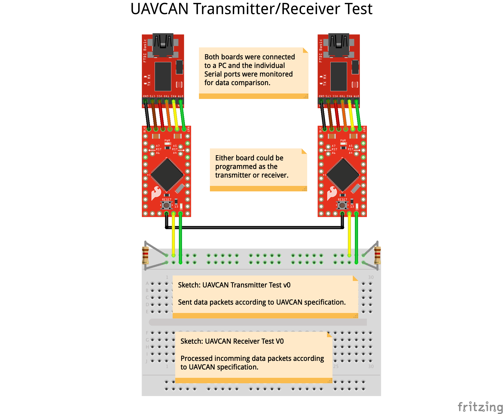

# CAN Transmitter Test

Tests the transmitting operation of the [AST-CAN485](https://www.sparkfun.com/products/14483) CAN transceiver and the encoding of [UAVCAN v0](https://legacy.uavcan.org/) messages.

Examples of transmitted messages are included below with extra debug information.

## Wiring



## Node Status

```
######## NODE STATUS ########

Node Status
  Uptime Sec: 3
  Health: 0
  Mode: 0
  Sub Mode: 0
  Vendor: 0

######## ENCODING NODE STATUS ########

Node Status Encoded Buffer: 3,0,0,0,0,0,0

Node Status Encoded Bits: 56

Node Status encoding successful!

######## QUEUING NODE STATUS ########

Canard Frame
  ID: 2416006422
  Length: 8
  Data: 3,0,0,0,0,0,0,C3

Node Status queueing successful!

######## TRANSMITTING NODE STATUS ########

Node Status transmission successful!
```

## Log Message

```
######## QUATERNION ########

Quaternion Text: 0.50,-0.10,0.76,-0.90

######## LOG MESSAGE ########

Log Message
  Level: 1
  Source: #.segment.wing
  Text: 0.50,-0.10,0.76,-0.90

######## ENCODING LOG MESSAGE ########

Log Message Encoded Buffer: 24,65,CE,6C,AC,ED,AC,AD,CE,85,CE,ED,2D,CC,E0,6,5,C6,A6,5,85,A6,5,C6,26,5,86,5,C6,E6,C5,85,A6,5,C7,26,1,40,0,0,0,0,0,0,0,0,0,0,0,0,0,0,0,0,0,0,0,0,0,0,0,0,0,0,0,0,0,0,0,0,0,0,0,0,0,0,0,0,0,0,0,0,0,0,0,0,0,0,0,0,0,0,0,0,0,0,0,0,0,0,0,0,0,0,0,0,0,0,0,0,0,0,0,0,0,0,0,0,0,0,0,0,0

Log Message Encoded Bits: 307

Log Message encoding successful!

######## QUEUING LOG MESSAGE ########

Log Message queueing successful!

######## TRANSMITTING LOG MESSAGE ########

Canard Frame
  ID: 2420113174
  Length: 8
  Data: FF,25,24,65,CE,6C,AC,81
Transmit: Success

Canard Frame
  ID: 2420113174
  Length: 8
  Data: ED,AC,AD,CE,85,CE,ED,21
Transmit: Success

Canard Frame
  ID: 2420113174
  Length: 8
  Data: 2D,CC,E0,6,5,C6,A6,1
Transmit: Success

Canard Frame
  ID: 2420113174
  Length: 8
  Data: 5,85,A6,5,C6,26,5,21
Transmit: Success

Canard Frame
  ID: 2420113174
  Length: 8
  Data: 86,5,C6,E6,C5,85,A6,1
Transmit: Success

Canard Frame
  ID: 2420113174
  Length: 7
  Data: 5,C7,26,1,40,0,61
Transmit: Success

LogMessage transmission successful!
```

## Camera Gimbal Status

```
######## CAMERA GIMBAL STATUS ########

Camera Gimbal Status
  Gimbal ID: 22
  Mode: 1
  Orientation X: 0.00
  Orientation Y: 0.02
  Orientation Z: 0.00
  Orientation W: 1.00

######## ENCODING CAMERA GIMBAL STATUS ########

Camera Gimbal Status Encoded Buffer: 16,1,0,0,0,0,0,0,0,F4,0,0,0,0,0,0,0,0,0,0,0,0,0,0,0,0,0,0,0

Camera Gimbal Status Encoded Bits: 224

######## QUEUING CAMERA GIMBAL STATUS ########

Camera Gimbal Status queueing successful.

######## TRANSMITTING CAMERA GIMBAL STATUS ########

Camera Gimbmal Status transmission successful!
```

## Key Value

```
######## KEY VALUE ########

Key Value
  Value: 1.00
  Key: W

######## ENCODING KEY VALUE ########

Key Value Encoded Buffer: 0,F4,7F,3F,57,0,0,0,0,0,0,0,0,0,0,0,0,0,0,0,0,0,0,0,0,0,0,0,0,0,0,0,0,0,0,0,0,0,0,0,0,0,0,0,0,0,0,0,0,0,0,0,0,0,0,0,0,0,0,0,0,0,0

Key Value Encoded Bits: 48

######## QUEUING KEY VALUE ########

Canard Frame
  ID: 2420109846
  Length: 7
  Data: 0,F4,7F,3F,57,0,D3

Key Value queueing successful!

######## TRANSMITTING KEY VALUE ########

Key Value transmission successful!

```

```
######## KEY VALUE ########

Key Value
  Value: 0.00
  Key: X

######## ENCODING KEY VALUE ########

Key Value Encoded Buffer: 0,0,28,3B,58,0,0,0,0,0,0,0,0,0,0,0,0,0,0,0,0,0,0,0,0,0,0,0,0,0,0,0,0,0,0,0,0,0,0,0,0,0,0,0,0,0,0,0,0,0,0,0,0,0,0,0,0,0,0,0,0,0,0

Key Value Encoded Bits: 48

######## QUEUING KEY VALUE ########

Canard Frame
  ID: 2420109846
  Length: 7
  Data: 0,0,28,3B,58,0,D4

Key Value queueing successful!

######## TRANSMITTING KEY VALUE ########

Key Value transmission successful!
```

```
######## KEY VALUE ########

Key Value
  Value: 0.02
  Key: Y

######## ENCODING KEY VALUE ########

Key Value Encoded Buffer: 0,80,9E,3C,59,0,0,0,0,0,0,0,0,0,0,0,0,0,0,0,0,0,0,0,0,0,0,0,0,0,0,0,0,0,0,0,0,0,0,0,0,0,0,0,0,0,0,0,0,0,0,0,0,0,0,0,0,0,0,0,0,0,0

Key Value Encoded Bits: 48

######## QUEUING KEY VALUE ########

Canard Frame
  ID: 2420109846
  Length: 7
  Data: 0,80,9E,3C,59,0,D5

Key Value queueing successful!

######## TRANSMITTING KEY VALUE ########

Key Value transmission successful!
```

```
######## KEY VALUE ########

Key Value
  Value: 0.00
  Key: Z

######## ENCODING KEY VALUE ########

Key Value Encoded Buffer: 0,0,0,0,5A,0,0,0,0,0,0,0,0,0,0,0,0,0,0,0,0,0,0,0,0,0,0,0,0,0,0,0,0,0,0,0,0,0,0,0,0,0,0,0,0,0,0,0,0,0,0,0,0,0,0,0,0,0,0,0,0,0,0

Key Value Encoded Bits: 48

######## QUEUING KEY VALUE ########

Canard Frame
  ID: 2420109846
  Length: 7
  Data: 0,0,0,0,5A,0,D6

Key Value queueing successful!

######## TRANSMITTING KEY VALUE ########

Key Value transmission successful!
```
