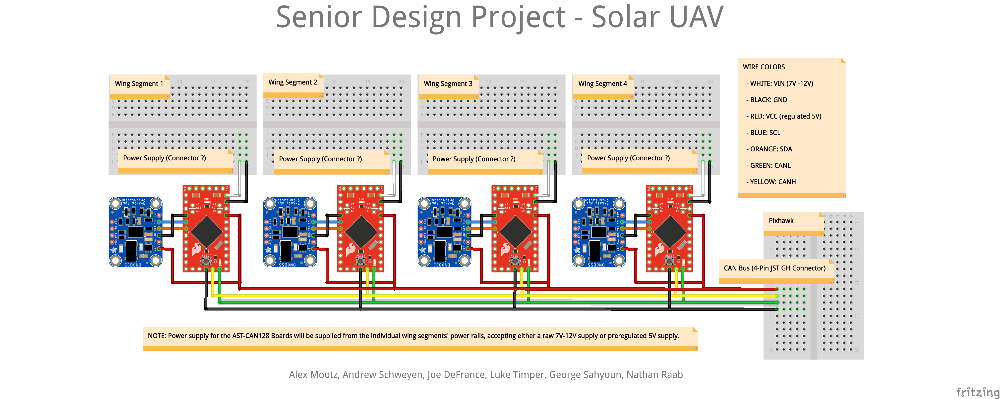
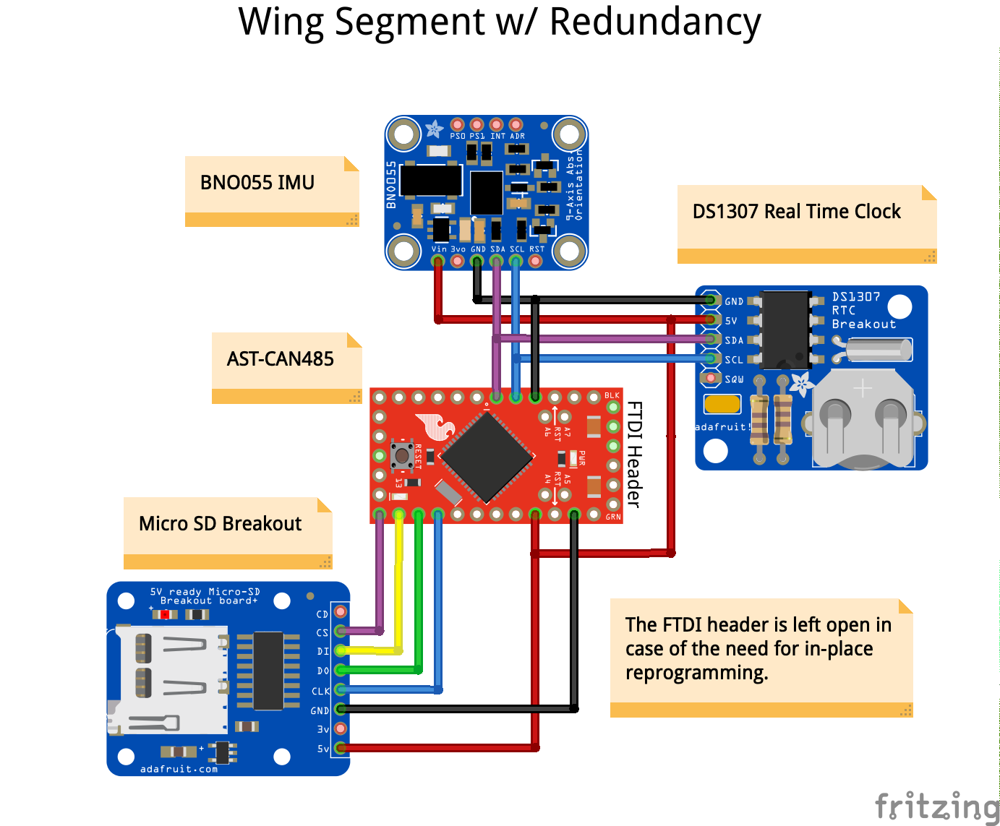

# Senior Design Project

Electrical Engineering Senior Design Project at the University of Minnesota - Twin Cities, Spring 2020

The purpose of this project is to read IMU sensor data from individual UAV wing segments and send it to a PX4 flight controller over CAN for the purpose of obtaining real-time wing segment orientation.

## Authors

Joe DeFrance (defra022@umn.edu)

Alex Mootz (mootz017@umn.edu)

Andrew Schweyen (schwe596@umn.edu)

Nathan Raab (raabx028@umn.edu)

George Sahyoun (sahyo002@umn.edu)

Luke Timper (timpe005@umn.edu)

## Getting Started

### Downloading

1. Open a terminal on your computer.

2. Navigate to your desired working directory.

3. Type `git clone` and the copy the link provided by clicking on the green `Clone or Download` button on this page.

4. Wait for the download to complete.

## System Layout

## Redundant System

Plans for a redundant SD logging system are in place such that if the UAVCAN bus ever fails, all data will be logged and stored in individual wing segment SD cards.

## Acknowledgements

We would like to thank Professor Nikolaos Papanikolopoulos, Travis Hanson, and all of the team members in the Solar UAV lab at the University of Minnesota - Twin Cities for allowing us to work on this amazing project with them.

We would also like to acknowledge Professor Paul Imbertson for his time and effort as our Senior Design Faculty Mentor.
